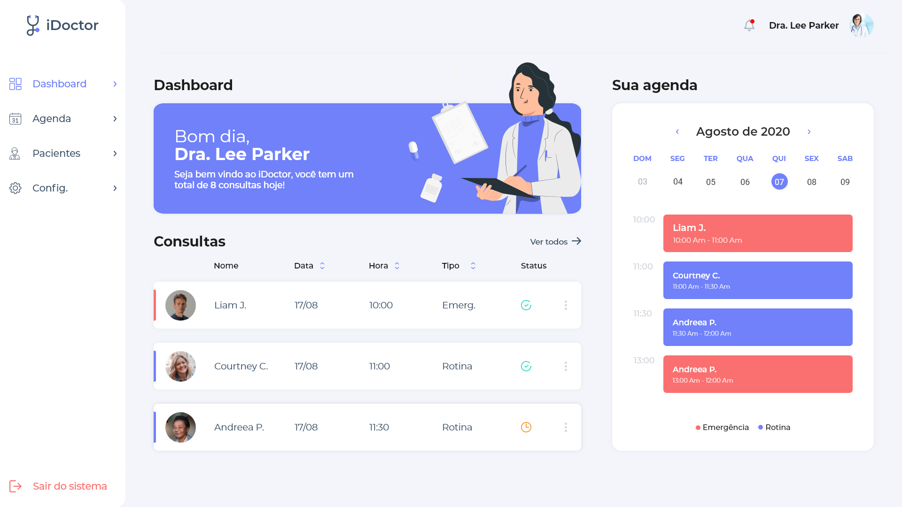

<h1 align="center">
  <br>
  <a href="https://idoctor.vercel.app"></a>
  <br>
</h1>

<h4 align="center">System that organizes and streamlines your clinic, has more practicality in your day to day with the software for clinics easier to use. We want your clinic to succeed as much as you do!</h4>

<p align="center">
  <a href="#how-to-use">How To Use</a> •
  <a href="#technologies">Technologies</a> •
  <a href="#team">Team</a> 
</p>



## How To Use

To clone and run this application, you'll need [Git](https://git-scm.com) and [Node.js](https://nodejs.org/en/download/) (which comes with [npm](http://npmjs.com)) installed on your computer. From your command line:

```bash
# Clone this repository
$ git clone https://github.com/vinniciusgomes/idoctor

# Go into the repository
$ cd idoctor

# Install dependencies
$ npm install

# Run the app
$ npm start
```

## Technologies 

This software uses these packages:

- [React](https://reactjs.org/)
- [TypeScript](http://typescriptlang.org/)
- [Node.js](https://nodejs.org/)
- [Styled Components](https://styled-components.com/)
- [AntDesign](https://ant.design/)
- [Date-fns](https://date-fns.org/)
- [Axios](https://github.com/axios/axios)
- [Lottie](https://airbnb.design/lottie/)

## Team

[](https://github.com/vinniciusgomes)  | [](https://github.com/felipens/)
---|---
[Vinnicius Gomes ](https://github.com/vinniciusgomes) |[Felipe Novais](https://github.com/felipens)
